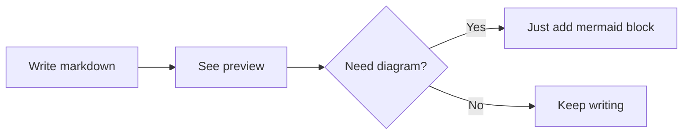

# 0.markview

Your markdown deserves more than one preview tab.

Open 10 files — get 10 previews. Each lives in its own tab, renders independently, and stays in sync with your edits. No fighting over a single shared panel.

## What you get

🔄 **One file = one preview.** Always. Open `README.md` and `CHANGELOG.md` side by side — both render live.

📖 **Preview by default.** Click any `.md` — you see the rendered result, not raw markup. Hit `Ctrl+E` when you need the source.

🧜 **Mermaid just works.** Drop a ```` ```mermaid ```` block — flowcharts, sequences, state diagrams appear inline. No extra extensions.

📑 **TOC in one click.** Hit ☰ — get a floating table of contents. Click a heading — smooth scroll.

📄 **Export to PDF.** One command, one file. Diagrams included, no page breaks cutting through your flowcharts.

🎨 **Follows your theme.** Light, dark, high contrast — preview adapts automatically.

⚡ **Loads what it needs.** Base preview: 5KB. Mermaid and PDF engine load only when you actually use them.

## Quick start

```
ext install vasilievsv.0-markview
```

Open any `.md` file. That's it.

## Keybindings

| What | Keys |
|------|------|
| Preview | `Ctrl+Shift+V` |
| Preview to side | `Ctrl+K V` |
| Edit source | `Ctrl+E` |
| Export PDF | Command palette → `Export to PDF` |
| Toggle TOC | ☰ button in preview |

## Mermaid

````markdown

````

Flowchart, sequence, state, class, ER, gantt, pie, git graph, mindmap, timeline, sankey, kanban — all supported.

## Settings

| Setting | Default | What it does |
|---------|---------|-------------|
| `multiPreview.autoClose` | `true` | Close preview when source tab closes |
| `multiPreview.openToSide` | `true` | Preview opens beside the source |
| `multiPreview.scrollSync` | `true` | Scroll sync between source and preview |
| `multiPreview.toc.enabled` | `true` | Enable TOC sidebar |
| `multiPreview.fontSize` | `14` | Preview font size |

## Built with

TypeScript · esbuild · markdown-it · highlight.js · mermaid.js · html2pdf.js · CustomTextEditorProvider API

## License

MIT
