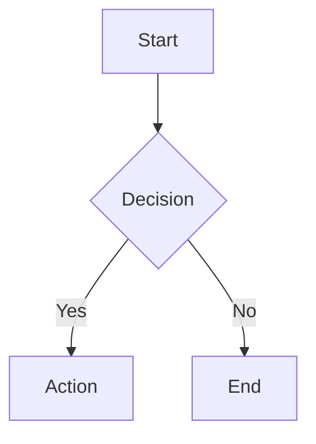

# 0.markview

Multi-preview markdown viewer for VS Code. Each `.md` file gets its own independent preview tab.

## Features

🔄 **Multi Preview** — open multiple `.md` files, each with its own preview tab. No shared state, no conflicts.

📖 **Default Viewer** — `.md` files open as rendered preview by default. `Ctrl+E` to edit source side-by-side.

📑 **TOC Sidebar** — click ☰ in preview to toggle table of contents. Click heading to navigate.

🧜 **Mermaid Diagrams** — flowcharts, sequence, state, class, ER, gantt, pie, git graph render inline.

📄 **PDF Export** — `Ctrl+Shift+P` → `0.markview: Export to PDF`. Single-page output, no page breaks.

🎨 **Theme Integration** — follows VS Code light/dark/high-contrast themes automatically via CSS variables.

💡 **Syntax Highlighting** — 190+ languages via highlight.js.

🔍 **Scroll Sync** — preview tracks source line position via `data-source-line` attributes.

⚡ **Lazy Loading** — mermaid.js (~5MB) and html2pdf.js (~2.4MB) load only when needed. Base preview is 4.8KB.

## Architecture

```
preview.ts (4.8KB)          ← always loaded
  ├── mermaid-init.ts       ← lazy: only if ```mermaid``` blocks found
  │   └── mermaid chunks    ← lazy: per diagram type (flowchart, sequence, etc.)
  └── html2pdf.js           ← lazy: only on Export PDF command
```

## Commands

| Command | Keybinding | Description |
|---------|-----------|-------------|
| `0.markview: Open Preview` | `Ctrl+Shift+V` | Open preview in current tab |
| `0.markview: Open Preview to Side` | `Ctrl+K V` | Open preview side-by-side |
| `0.markview: Edit Source` | `Ctrl+E` | Open source next to preview |
| `0.markview: Toggle Auto Preview` | — | Toggle auto-open behavior |
| `0.markview: Export to PDF` | — | Export current preview to PDF |
| `0.markview: Toggle TOC` | — | Toggle table of contents |

## Settings

| Setting | Default | Description |
|---------|---------|-------------|
| `multiPreview.enabled` | `true` | Enable multi-preview |
| `multiPreview.defaultViewer` | `"preview"` | Default viewer for .md files |
| `multiPreview.autoOpen` | `false` | Auto-open preview panel |
| `multiPreview.autoClose` | `true` | Auto-close preview when source closes |
| `multiPreview.openToSide` | `true` | Open preview to side |
| `multiPreview.scrollSync` | `true` | Bidirectional scroll sync |
| `multiPreview.toc.enabled` | `true` | Enable TOC |
| `multiPreview.fontSize` | `14` | Preview font size |
| `multiPreview.debounceMs` | `150` | Debounce delay for auto-open |

## Mermaid Support

````markdown

````

Supported: flowchart, sequence, state, class, ER, gantt, pie, git graph, mindmap, timeline, sankey, kanban.

## Tech Stack

- TypeScript + esbuild (dual entry + code splitting)
- markdown-it + highlight.js
- mermaid.js (lazy loaded, per-diagram chunks)
- html2pdf.js (lazy loaded, client-side PDF)
- CustomTextEditorProvider API

## Development

```bash
npm install
npm run compile      # build extension + webview
npm run typecheck    # type check
npm run watch        # watch mode
npm run package      # production build (minified)
# F5 in VS Code → Extension Development Host
```

## Project Structure

```
src/
├── extension.ts              ← activate/deactivate, commands
├── customMarkdownEditor.ts   ← CustomTextEditorProvider (default .md viewer)
├── previewManager.ts         ← standalone WebviewPanel[] (Ctrl+Shift+V)
├── markdownRenderer.ts       ← markdown-it + highlight.js + TOC extraction
├── autoPreviewManager.ts     ← auto-close on tab close
├── configManager.ts          ← settings wrapper
├── types.ts                  ← constants, interfaces
├── utils.ts                  ← debounce, helpers
├── logger.ts                 ← OutputChannel
└── webview/
    ├── preview.ts            ← webview entry (4.8KB base)
    ├── mermaid-init.ts       ← lazy mermaid loader
    └── html2pdf.d.ts         ← type declarations
```

## License

MIT
