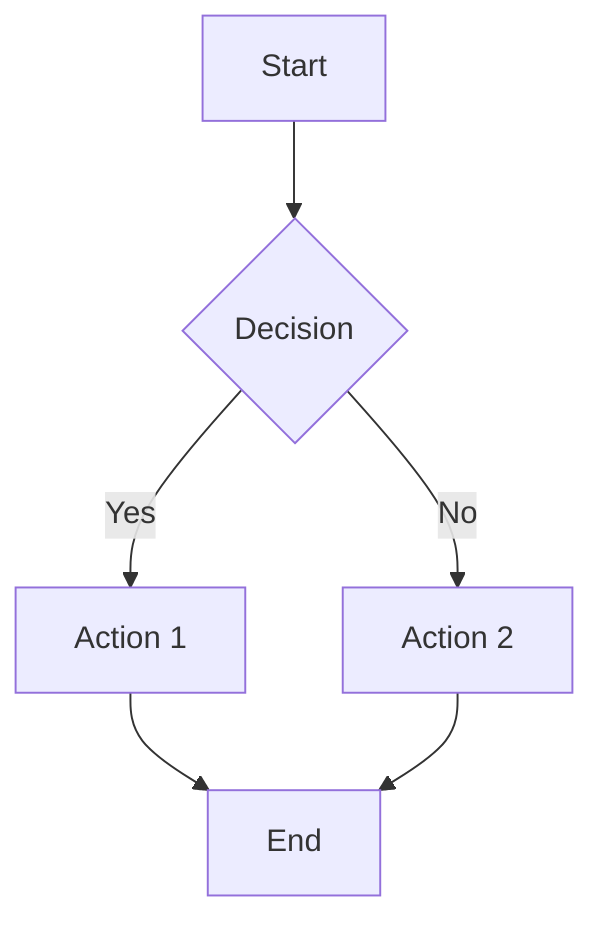
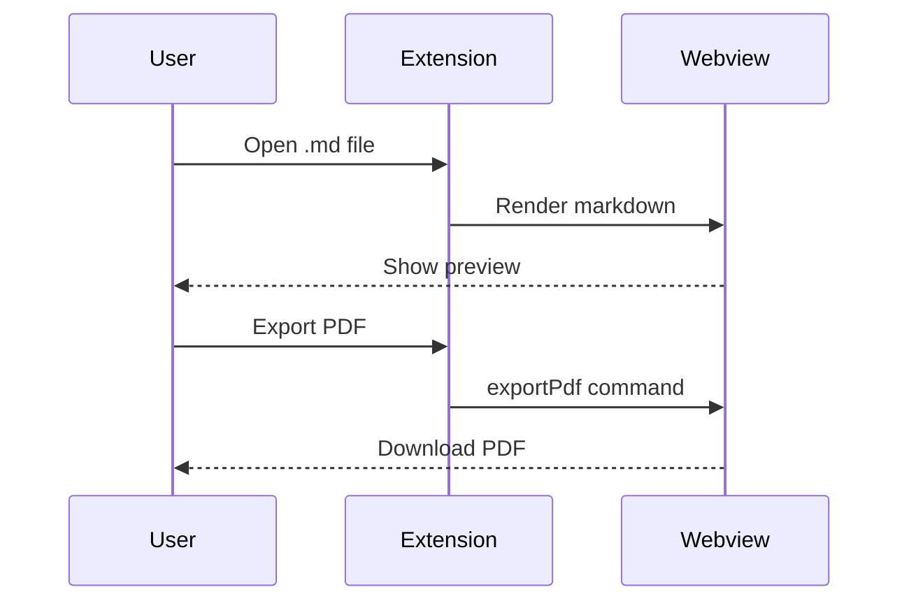
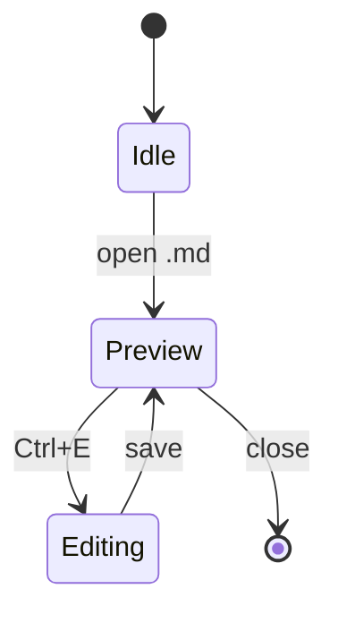

# Mermaid Test

## Flowchart


```mermaid
graph TD
    A[Start] --> B{Decision}
    B -->|Yes| C[Action 1]
    B -->|No| D[Action 2]
    C --> E[End]
    D --> E
```

## Sequence Diagram


```mermaid
sequenceDiagram
    participant U as User
    participant E as Extension
    participant W as Webview
    U->>E: Open .md file
    E->>W: Render markdown
    W-->>U: Show preview
    U->>E: Export PDF
    E->>W: exportPdf command
    W-->>U: Download PDF
```

## State Diagram


```mermaid
stateDiagram-v2
    [*] --> Idle
    Idle --> Preview: open .md
    Preview --> Editing: Ctrl+E
    Editing --> Preview: save
    Preview --> [*]: close
```

## Regular Code (not mermaid)

```typescript
const x = 42;
console.log(x);
```
